# How to create a IoT project for monitoring a home environment

## Overview

Author: Pauliina Raitaniemi (pr222ja)

Estimated time: 
- About 8 hours (without any troubleshooting)

This is a project for reading temperature and humidity at home to present daily readings in a diagram, together with weather readings from a weather station.

### Objective

As the summers can be quite hot it would be interesting whether the inside temperature is affected in any way by the outside weather. For the scope of this project the IoT device will only make readings from inside with a WiFi connection. 

The outside readings will be relied by an Open API from a weather station, in a more IoT-way of doing this an another device for outside readings would have been interesting to get more precise data to compare with. 

Humidity readings are also included in order to see if a humidifier could be justified to buy and if it is bought, to check that it keeps the humidity within accepted ranges. Perhaps the weather humidity somehow also could give some unexpected insights. 

In order to have enough detailed readings to view the client application provides data for any chosen day with a 1-hour interval for that day. 

### Material
All the material was bought from [https://www.electrokit.com/](https://www.electrokit.com/)

- [Arduino Explore IoT Kit](https://www.electrokit.com/produkt/arduino-explore-iot-kit/) approximate cost: 130 EUR
- [LiPo battery 3.7V 2200mAh](https://www.electrokit.com/produkt/batteri-lipo-18650-cell-3-7v-2200mah/) approximate cost: 5 EUR

**From the Arduino Explore IoT Kit** these parts were used:
- [Arduino MKR WiFi 1010](https://docs.arduino.cc/hardware/mkr-wifi-1010)
- [MKR IoT Carrier](https://docs.arduino.cc/hardware/mkr-iot-carrier)
- Micro USB cable.
- Protective plastic case.
- Cable to connect power to the controller from the board when a battery is used within the carrier.

With the MKR IoT Carrier the built-in HTS221 temperature- and humidity-sensor was utilized, as well as the display and touch buttons for presenting sensor readings directly on the carrier itself.

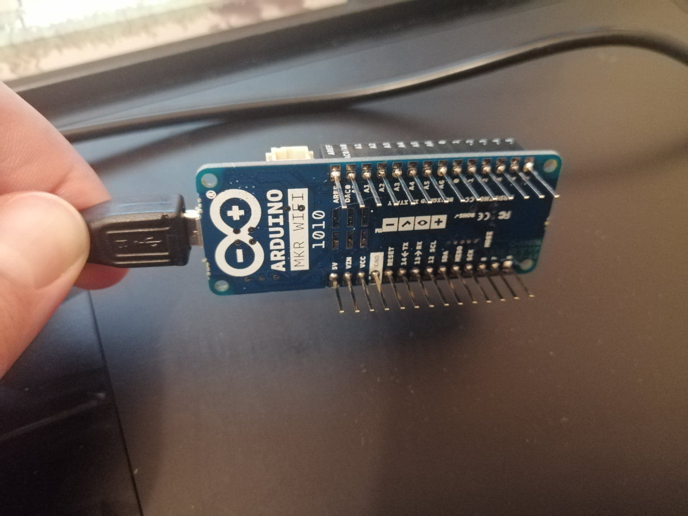
The Arduino MKR WiFi 1010 micro controller and with the connected micro USB cable.

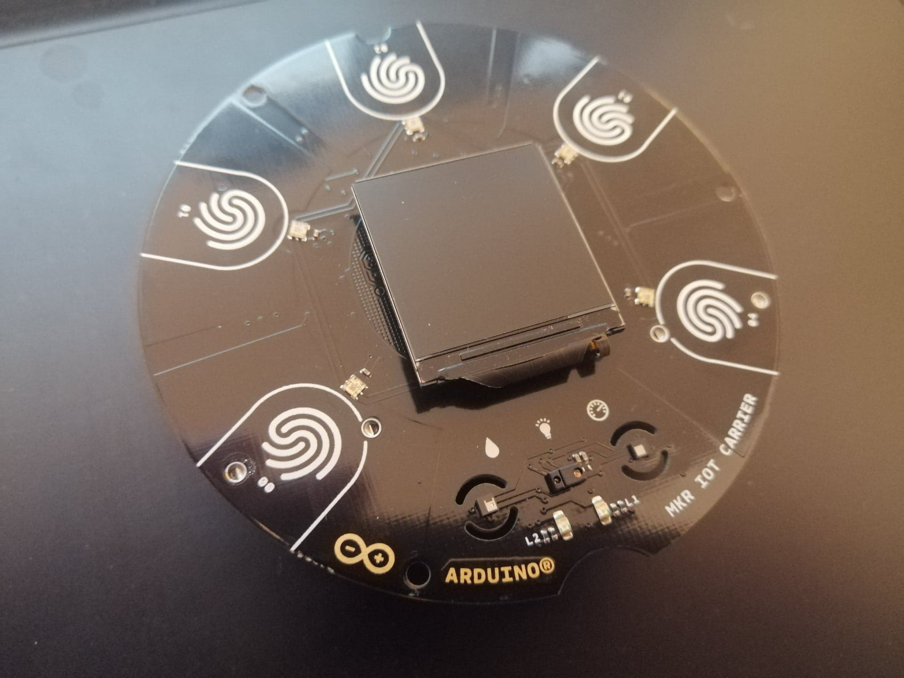
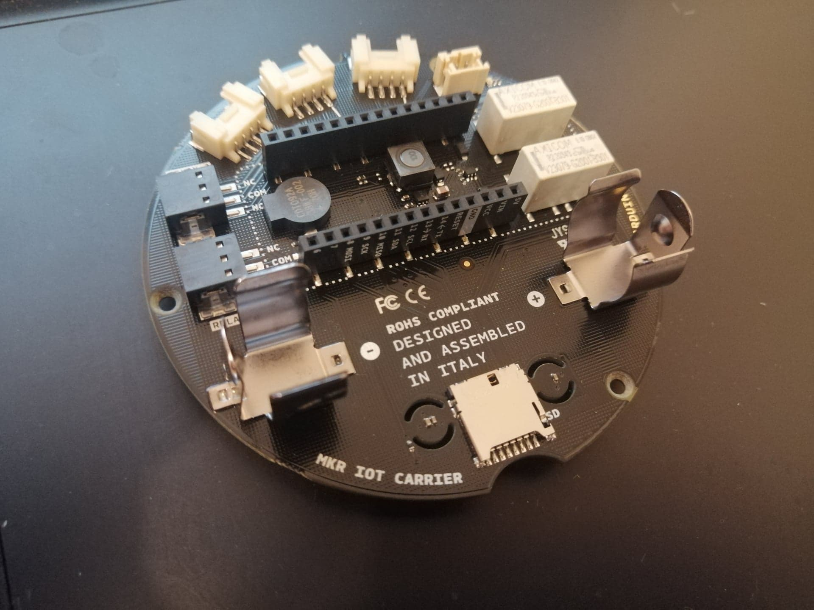
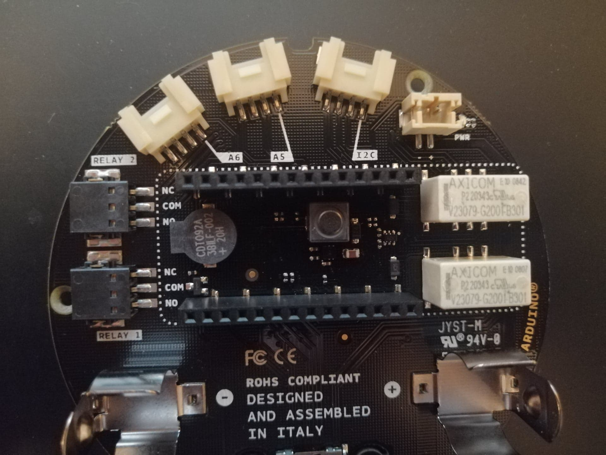
The MKR IoT Carrier top and bottom without anything connected to it.

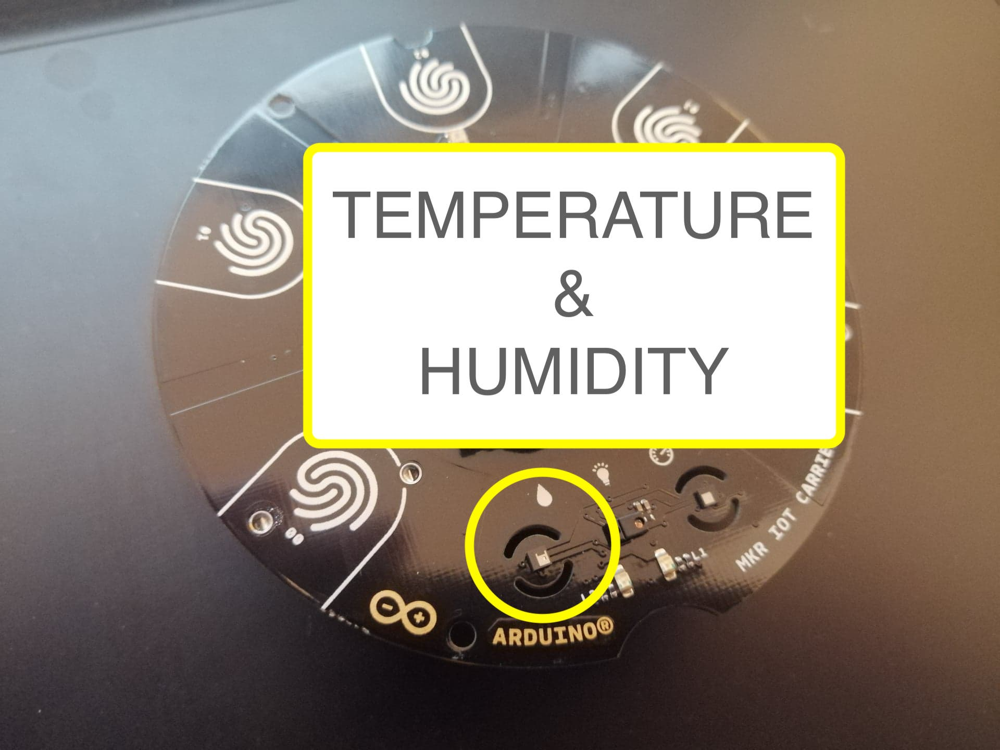
The placement of the [HTS221](https://www.st.com/resource/en/datasheet/hts221.pdf) sensor which reads humidity and temperature. The temperature has an accuracy of ± 0.5 °C and works within the ranges of 15 to +40 °C. The humidity has an accuracy of ± 3.5% rH and works within humid ranges between 20 to +80% rH. The carrier uses the [I2C protocol on Arduino](https://docs.arduino.cc/learn/communication/wire) to communicate sensor readings to the controller.

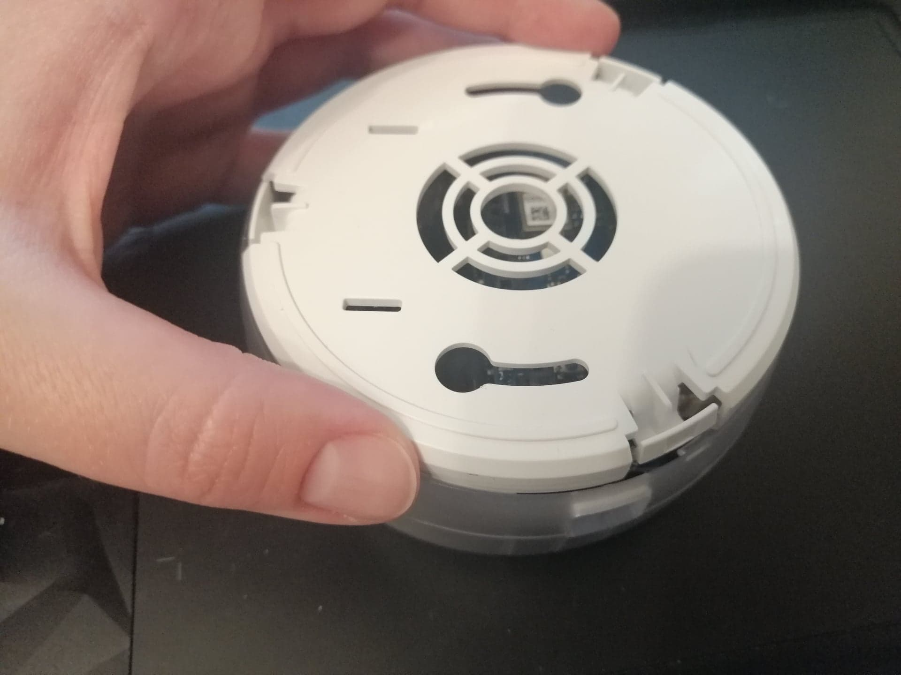
Plastic case for protecting the device. The case is designed so that you can still connect external sensors to the controller and connect with the micro USB cable.

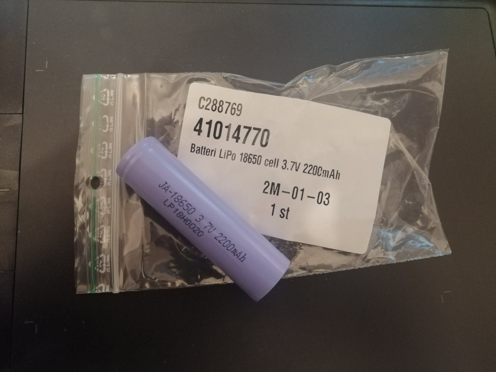
The lithium battery that can be used with the carrier (not included in the Arduino Explore IoT Kit), which enables the device to be run wirelessly. However, the battery will only have enough charge for lasting for about two days or so but it can be re-charged with a micro USB cable to the controller. 


The back- and red-cable to connect the carrier to the mounted controller when using the battery.

### Computer setup
The device was programmed by using a M1 Mac that also runs Rosetta and by using the installed Arduino 2.0 IDE. 

An arduino account was created and the bought kit was registered in order to access its included one year of the [Arduino Maker Plan](https://www.arduino.cc/cloud/plans). 

The server- and client-application is built with [Next.js](https://nextjs.org/) which runs in a [Node.js](https://nodejs.org/en/) environment, Node also needs to be installed on the computer. For this, [Git](https://git-scm.com/) was used for version control and the code was written in the IDE [Visual Studio Code](https://code.visualstudio.com/). [React Apex Charts](https://www.npmjs.com/package/react-apexcharts) was used on the client side for displaying the diagrams. [Moment](https://www.npmjs.com/package/moment) is used both on the serverside and clientside to handle dates more easily.

- Using downloaded IDE for Arduino:

    The IDE can be dowloaded from [https://www.arduino.cc/en/Guide](https://www.arduino.cc/en/Guide)

    To do all necessary steps to get started follow the documentation at [https://docs.arduino.cc/](https://docs.arduino.cc/) and choose the ```MKR WIFI 1010``` board and continue by following ```Quickstart```.

    As the quickstart mentions you use the verify-button in the IDE to compile the code in order to make sure that everything runs correctly. Then make sure that the device is connected to the computer with the USB-cable and push the Upload-button to upload the code to the device. 

- To use the web editor together with Arduino IoT Cloud:

    In order to use the web editor, you need to download a [plugin](https://create.arduino.cc/getting-started/plugin/install) on your computer. [Welcome page to plugin](https://create.arduino.cc/getting-started/plugin/welcome). The preferred browsers to use with it is Chrome or Firefox. So by using the browser you can log in to the Arduino IoT Cloud and use the web editor there.

    However, using the web editor ended up not being as user friendly and reliable as using the downloaded IDE as the controller easily lost connection without reliably re-connecting. On the other hand the web editor should also enable transferring code to the controller wirelessly over WiFi once the controller has code that connects to the Arduino Cloud and is online. 

    You can access the code in the web editor from the downloaded IDE by logging in to your account and pull the code from the cloud, edit and then push it to the cloud to update the code. You can choose freely whether to transfer the code to the controller from the downloaded IDE or the web editor afterwards. [See more about syncing sketches](https://docs.arduino.cc/software/ide-v2/tutorials/ide-v2-cloud-sketch-sync).

- Handle Arduino libraries:

    When using the downloaded IDE you need to install needed libraries to your computer, which you can do through the IDE itself. For the web editor you should not need to install libraries as they are already available in the Arduino Cloud. [See more about how to install libraries](https://docs.arduino.cc/software/ide-v2/tutorials/ide-v2-installing-a-library).

- Using the Serial Monitor:
  
    The [Serial Monitor](https://docs.arduino.cc/software/ide-v2/tutorials/ide-v2-serial-monitor) is very useful to use when developing for the controller, since that is where you can see information about errors that occurs when running the code and when you still have the controller connected to the computer.

### Putting everything together
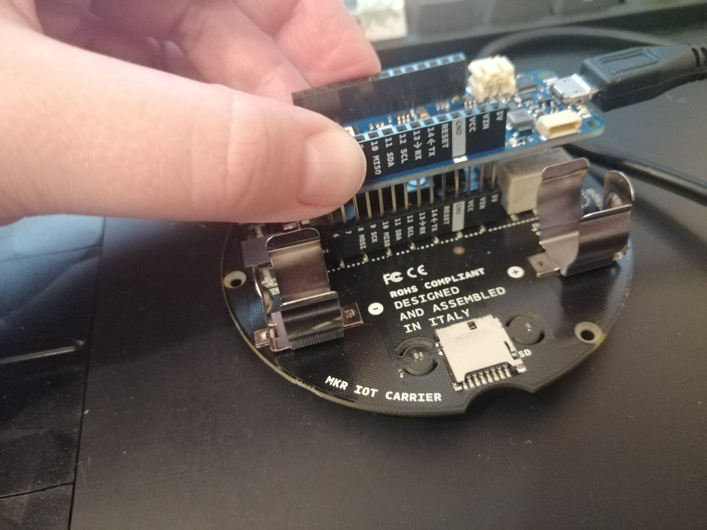
When connecting the controller to the carrier it is important to make sure that the pins match, for example you can see in the image that the GND-pin marked with white color on both the the controller and the carrier. It is also important to try keeping the pins as straight as possible.

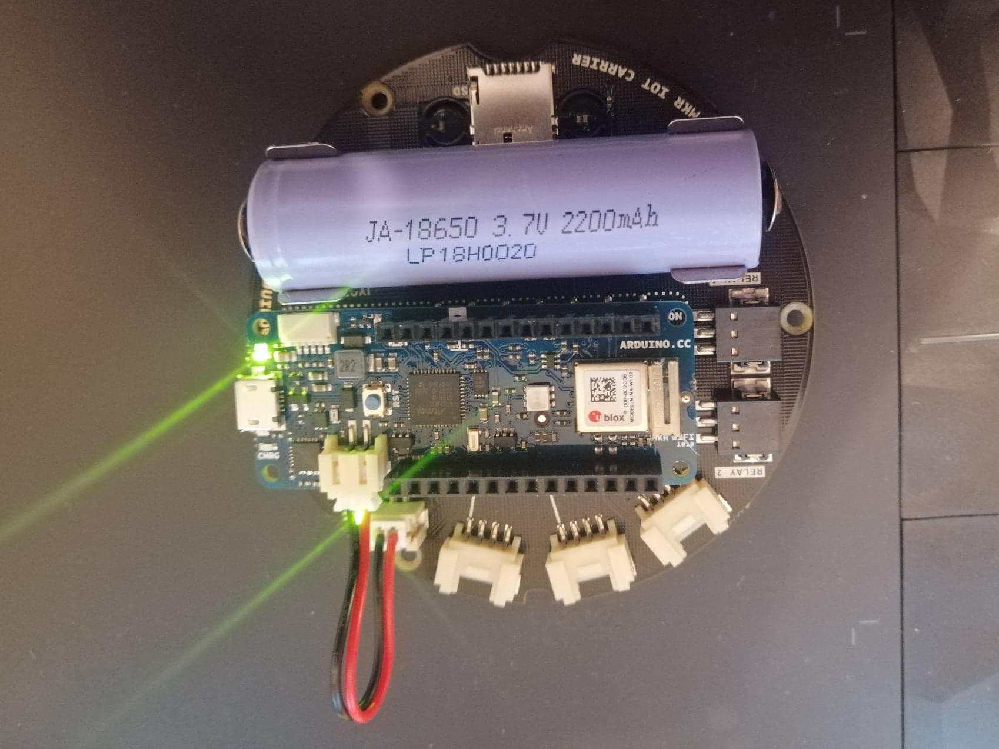
Use the included black- and red- cable to make a connection between the controller and the carrier. This enables the controller to get energy to the battery that is connected to the carrier and the controller can also charge the battery by connecting the controller with a micro USB cable. When connecting the battery to the carrier, it is important to make sure that the positive and negative side matches. On the battery [the minus side is completely flat](https://www.large.net/news/8ju43mh.html) and should be on the side marked with a minus side as seen in the previous image of the bottom side of the carrier.

The MKR IoT Carrier operates only on 3.3V but is designed to work with a LiPo-battery that has 3.7V. That is good to keep in mind when looking for external sensors to connect with, so you don't accidentally try connecting something that requires for example 5.5V in order to operate. 

However, the carrier does also have two built-in relays with two separate "high power pins" which are capable to handle up to 24V each. An example use of these relays could be to control an external lamp switching it on and off by controlling those higher power pins that connects to an 24V-battery and the lamp. With a maximum capacity to handle 24V, it also means that the carrier should never in any way be connected to a standard power outlet in the wall.

With so many features, form factor and different sensors that the carrier provides it is a very well designed consumer-level product, perfect for the IoT enthusiast. The features used here are just a small part of what is possible to experiment with. 

For more professional setting it becomes much of a question about if the particular use case is broad enough to justify the price, as you can get away with much less if you only are looking for one or two things. On the other hand the form factor could be a benefit if the usage of breadboards is too clumsy.

An important aspect could also be the short battery life as the carrier draws out the battery within a couple of days, depending on the battery. For professional use that may not be enough time for a wireless connection. Then the consideration for where to place it comes into play, since it needs to always be connected to a power source through the micro USB cable. 

### Platform
To start with we will be using the Arduino IoT Cloud platform, using the 1-year Maker-tier that is included with the kit-purchase. Otherwise the plan costs about 6$ per month as a monthly subscription. The Cloud also works with some third-party controllers, making it an option to expand with hardware outside the Arduino brand.

The most important differences between the free and the Maker plan:

|           | Free | Maker |
|-----------|------|-------|
| Cost      |  No  | 5.99 $/month |
| Things    |  2   |  25   |
| Variables |  5   | unlimited |
| Cloud Data Retention | 1 day | 3 months |
| Cloud API | No | 10 req/sec |
| Over-Air Updates | No | Yes |

 See more about the [Cloud Plans](https://www.arduino.cc/cloud/plans).

Since this is a quite small IoT project we could get away with only the free plan, if it would not be for that we are using the Cloud API in this instance and the data retention with the Maker plan is beneficial for accessing data over a longer period of time. 

The Arduino IoT Cloud abstracts away quite a lot when it comes to handling and setting up the connection between the thing and the internet. It makes it easy to get started in order to faster getting to explore the things you could do with the MKR 1010 and the IoT Carrier in the kit. 

However, there are lost of possibilities to not having to use the paid plan and in that case we need to firstly consider how and where to store data for a longer period than just one day and secondly how to access this data. More details about this is described later when talking about using different protocols for Data flow and Connectivity.

Since the Cloud's REST API is limited to 10 requests per second it is limited for usage intended for a bigger audience to use it at the same time. For personal use and sharing for friends and family this is certainly enough, but for more users a separate scalable cloud solution probably is an idea. 

### The code

- Thing code: [https://github.com/pr222/arduino](https://github.com/pr222/arduino) 
- Application code: [https://github.com/pr222/home-environment](https://github.com/pr222/home-environment) 
- Deployed at: [https://home-environment.vercel.app/](https://home-environment.vercel.app/)

Needed libraries:
- Arduino_MKRIoTCarrier (make sure to install the library together with any needed dependencies when prompted)
- For any libraries needed for the Arduino IoT Cloud, those will automatically be generated to the cloud sketch when setting up the thing in the [IoT Cloud](https://create.arduino.cc/iot/).

About the files in the [repository](https://github.com/pr222/arduino):
- The [Carrier Display](https://github.com/pr222/arduino/blob/main/carrier-display.ino) sketch can be independently uploaded to the controller. It enables you to show latest readings of temperature and humidity on the carrier's screen. 

- The [Cloud Connection](https://github.com/pr222/arduino/blob/main/cloud-connection.ino) and [Cloud and Display](https://github.com/pr222/arduino/blob/main/cloud-and-display.ino) are both dependent on being part of the setup created in Arduino IoT Cloud. In the **Cloud Connection**-file you see how I got the connection working for the thing to get connected to the cloud. It was a big struggle to get it to work with what order the lines work best with and where to put necessary delays for letting everything run smoothly without crashing. The main probable culprit that I could identify researching discussions online was that in order to keep the cloud-connection running is that ```ArduinoCloud.update();``` needs to be called without too much delays in between, therefore long and demanding loops are not recommended. The **Cloud and Display**-file is essentially a mix of the cloud connection and the previous carrier's display code, this time reading both temperature and humidity to the cloud, compared to only reading the temperature in the first cloud connected sketch.

By connecting to the Arduino IoT Cloud it enables in the background the WiFi connection. So there is no need to write any extra code for enabling the WiFi connection. However, you still may need to update the [WiFi NINA firmware](https://docs.arduino.cc/software/ide-v2/tutorials/ide-v2-fw-cert-uploader) as well as uploading [root-certificates](https://docs.arduino.cc/software/ide-v2/tutorials/ide-v2-fw-cert-uploader) to the controller. You also need to add the name and the password for your WiFi in the Cloud sketch's tab/file called ```arduino_secrets.h```. This way your WiFi credentials should be handled safely, and that is also why all the files that are generated by Arduino Cloud has not been provided in the repositories with the Arduino code.

Code that you may want to adjust for your needs: 

You may need to [calibrate the temperature sensor](https://support.arduino.cc/hc/en-us/articles/4411202645778-How-to-calibrate-the-MKR-IoT-Carrier-s-temperature-sensor). Do do that you adjust the temperature reading value with the difference between the sensors reading and the temperature reading from another temperature reading source.

For example, if the temperature need to be 3 degrees higher, just add ```+3``` to the reading like displayed below:
```
temperature = carrier.Env.readTemperature()+3;
```

Depending on if you plan to use the protecting case for the carrier you may want to change the ```CARRIER_CASE``` to true so that the sensor readings will adjust to that. If not specifying the variable it will default to false, so just add this in the setup()-function:
```
CARRIER_CASE = true;
```

The code for the server and client application is available in the [Home Environment](https://github.com/pr222/home-environment) repository. The server provides an API that communicates with the Arduino's IoT Cloud REST API and queries the REST API for 1 sensor reading per hour for one day (for both temperature and humidity) and returns the result to the client. The client only needs to specify in the request URL a query with the date formatted as YYYY-MM-DD. The server also lets the client ask for weather-readings that the server gets from [SMHI's Open API](http://opendata.smhi.se/apidocs/metobs/index.html). The client application then presents a diagram for one 24-hour day with data of temperature and humidity from the IoT thing as well as the weather information. The client application also lets the user choose from a calendar which day to present readings from.

### Data flow / Connectivity
To connect to the Arduino IoT Cloud three parts are needed and will be automatically generated when setting up a thing on their site. The three parts are as follows:

1. The main file that you can use to att your own code in the setup() function for code that executes once at the start of the program, as well as the loop() function that will run continously after the setup. 

```
#include "thingProperties.h"
#include "arduino_secrets.h"

void setup() {
    // Defined in thingProperties.h
    initProperties();

    // Connect to Arduino IoT Cloud
    ArduinoCloud.begin(ArduinoIoTPreferredConnection);
}

void loop() {
    ArduinoCloud.update();
}
```

2. The credentials for the WiFi that the device should be communicating through.

```
#define SECRET_SSID "{YOUR-WIFI-NAME}"
#define SECRET_PASS "{YOUR-WIFI-PASSWORD}"
```

3. Where the thing's properties are specified and the wifi credentials handled for initiating the connection. 

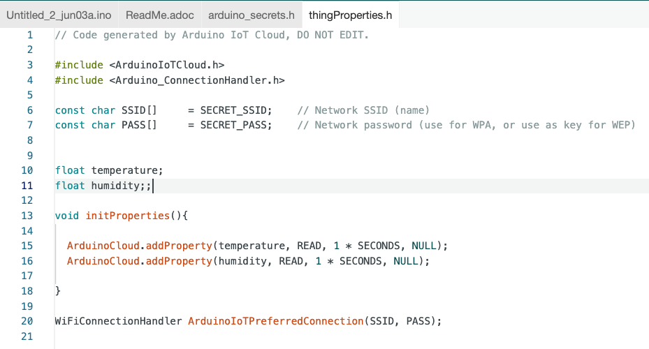

The variables in this project is set up to send data to the cloud every 1 seconds. Instead of sending it further to another place, we make use of [Arduino's REST API](https://www.arduino.cc/reference/en/iot/api/) to get the data we want when we need it. In this case we ask the cloud to provide one sensor reading per hour for a timespan of 24 hours in order to get data for one day. The downside by using the REST API is that the client application cannot automatically receive new data when new sensor readings reaches the cloud. 


- Using WiFi independently:

    If you would want to make a WiFi connection without using the Arduino IoT Cloud you can follow [this guide](https://www.arduino.cc/en/Guide/MKRWiFi1010/connecting-to-wifi-network) to get started with the (WiFiNINA library](https://www.arduino.cc/reference/en/libraries/wifinina/). With this you could set up a simple web server that could for example send HTTP requests for each sensor readings for storing the data into a database.

    Using the WiFi library could be extra useful in the case that you only have a free Arduino IoT Cloud plan, or not intend to use the cloud at all. To use it because of the free plan it would be beneficial in order to send data for storing information for longer period of time than the 1-day data retention that the free plan offers.

- Using a SD-card:
  
    With the MKR IoT Carrier there is also a place to connect a SD-card, you can use the [SD library](https://www.arduino.cc/reference/en/libraries/sd/) to write to and from the carrier. This could be used as an extra backup in case any online transfers of data would fail, or you could save data on the card and transfer a batch of data online scheduled with more time in between transfers.

- Using WebHooks:

    When using the Arduino IoT Cloud you can through their platform [setup webhooks](https://docs.arduino.cc/cloud/iot-cloud/tutorials/webhooks) to third-party platforms. The webhooks can be setup in the cloud even with a free cloud plan. Why not send
    sensor readings and save them to a Google Sheet?

- Using Bluetooth:

    With the MKR 1010 controller you can connect with BLE by using the [Bluetooth library](https://www.arduino.cc/reference/en/libraries/arduinoble/) for Arduino. Thanks to this I could have the kit for this project as the main gathering "unit" and connect it wirelessly to more simple setups of micro controllers and sensors in order to monitor the environment of all rooms in the home. Although you can also [connect devices](https://docs.arduino.cc/cloud/iot-cloud/tutorials/device-to-device) using WiFi through the Arduino IoT Cloud connection. Bluetooth is however a good choise for temperature and humidity readings since the small amount of data and require less power, making it a good choise to use with batteries that hold for a long time.

- Using MQTT:

    Another way to communicate between devices is to use the MQTT-protocol to publish data over a low bandwidth. There are several Arduino libraries to manage MQTT on the controllers, for example by using the [ArduinoMqttClient library](https://docs.arduino.cc/tutorials/uno-wifi-rev2/uno-wifi-r2-mqtt-device-to-device). The Arduino IoT Cloud also comes with a so called broker which can be used through their npm module [arduino-iot-js](https://www.npmjs.com/package/arduino-iot-js). 

    But a popular way to manage MQTT communication is to use the software tool [Node-Red](https://nodered.org/). If you have any of the paid Arduino IoT Cloud plans, you can use Node-Red directly [through the cloud](https://docs.arduino.cc/cloud/iot-cloud/tutorials/nodered). If you are on the free plan or choose not to use the IoT Cloud at all you can still use [Node-Red with Arduino](https://nodered.org/docs/faq/interacting-with-arduino), but in that case the device has to be connected to the computer with USB. 

- API information model:
  
    A very minimal information model was used for the API as is described in the [Home Environment](https://github.com/pr222/home-environment#using-the-api) repository with only one endpoint that returns both temperature and humidity for the queried date. 

### Presenting the data

The data is presented through a Next.js application by using React on the frontend and having an API on the backend that does the calls to the Arduino Cloud's REST API and the SMHI open weather API. 

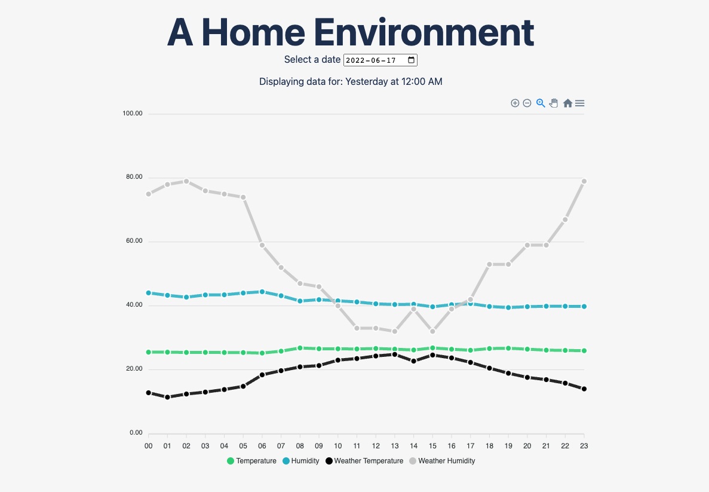

In this case, as discussed previous about the platform, the Arduino IoT Cloud retains the data for 3 months according to the Maker-plan included with the kit purchase. 

We have also set up the variables for the sensor readings to update every 1 second. For the client application however we only query a reading per hour for one particular day, since the variation of the data probably won't change that much to make any significant difference.

If we would have used a database solution based on InfluxDB or perhaps using Elastic Search on top of a database we probably could have more easily played around with more varied queries and aggregated data. The REST API provided for the Arduino Cloud will however be enough for this case. 

Since the client application only displays data per hour, it can be nice to setup a dashboard in the Arduino IoT Cloud's webpages to see that the data is updating as it should.

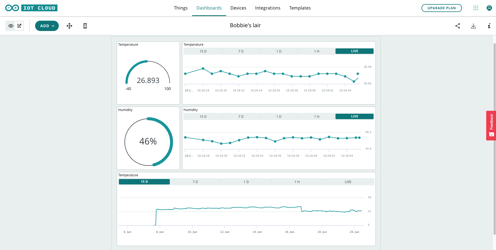

### Finalizing the design
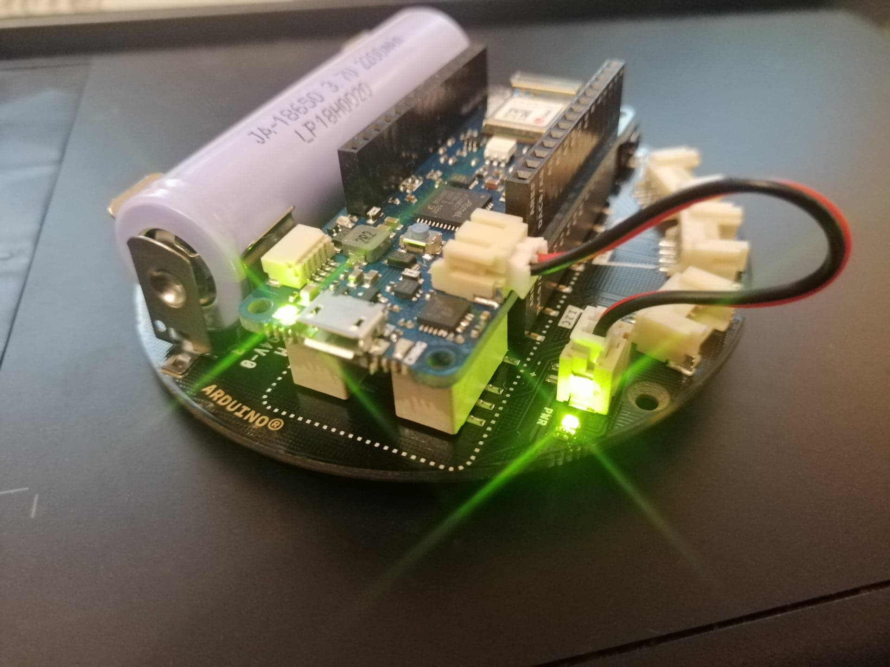
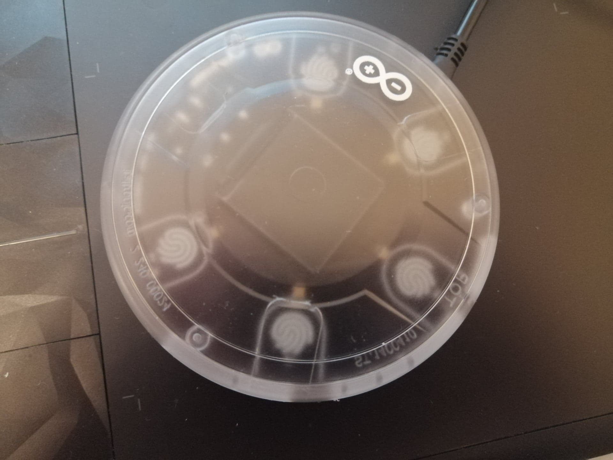
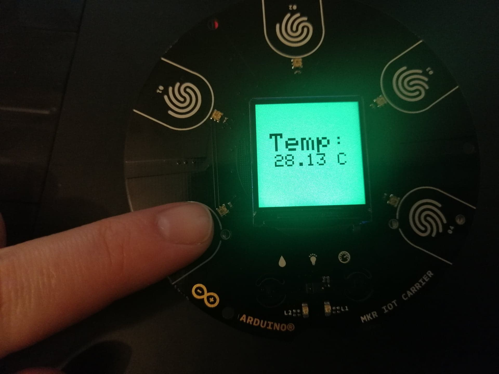
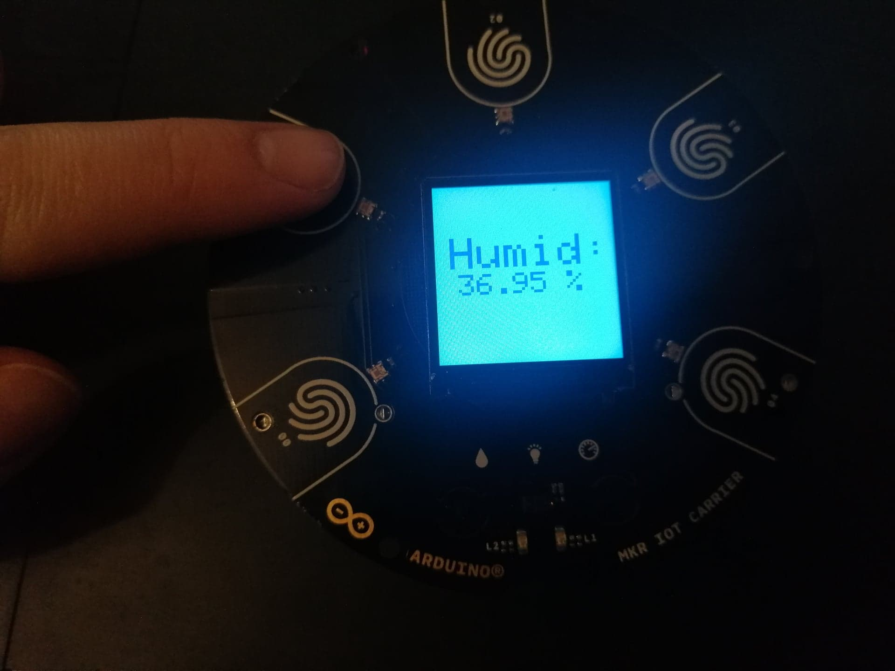
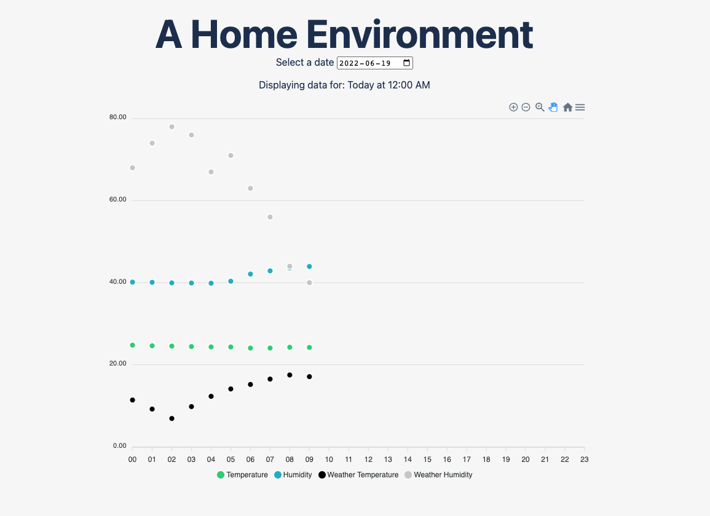

>Show the final results of your project. Give your final thoughts on how you think the project went. What could have been done in another way, or even better? Some pictures are nice!
>- [x] Show the final results of the project
>- [x] Pictures
>- [ ] Video presentation of the project

The project provided a good start to get going with IoT as a first IoT project. It was however very surprising how much of a struggle it would be to only to get the connection to the Arduino Cloud working. Even so, it has peeked my interest to continue exploring on how to do it more "manually" by using the different libraries that are available to establish different kinds of communications. Especially with a Raspberry Pi waiting in the cupboard there is so many possibilities ahead.

In regards to the MKR IoT Carrier there is also much more functionalities to make use of, such as the [pressure sensor](https://www.st.com/resource/en/datasheet/dm00140895.pdf), the RGB lights and even the sensor for [measuring proximity, light, colors and gestures](https://docs.broadcom.com/doc/AV02-4191EN). 

With the touch buttons together with the small screen there is also the possibility to create simple applications. One example first in mind comes to add different labels that could be associated to the temperature and humidity data, like "hanging laundry" or which room the device is currently placed in.

Of course another perfect next step could be to use the soil moisture sensor that is also included in the kit and have the carrier's Buzzer "buzz out" a sound when the plant needs to be watered. 

### Additional resources
- [Arduino Basics](https://docs.arduino.cc/learn/)
- [Arduino Language Reference](https://www.arduino.cc/reference/en/)
- [All built in Arduino code examples](https://docs.arduino.cc/built-in-examples/)
- [How to use the Arduino_MKRIoTCarrier library](https://www.arduino.cc/reference/en/libraries/arduino_mkriotcarrier/)
- [MKR IoT Carrier Technical Reference/Cheat Sheet](https://docs.arduino.cc/tutorials/mkr-iot-carrier/mkr-iot-carrier-01-technical-reference)
- [Getting started with IoT Cloud - official](https://docs.arduino.cc/cloud/iot-cloud)
- [Getting started with IoT Cloud - in project hub](https://create.arduino.cc/projecthub/133030/iot-cloud-getting-started-c93255)
- [Troubleshooting connection to IoT Cloud](https://support.arduino.cc/hc/en-us/articles/360019355679-If-your-device-can-t-be-added-or-won-t-connect-to-IoT-Cloud)
- [IoT Cloud Technical Reference/Cheat sheet](https://docs.arduino.cc/cloud/iot-cloud/tutorials/technical-reference)
- [Solution for connectivity issues in Arduino IoT Cloud](https://forum.arduino.cc/t/new-topic-error-in-iot-cloud-kit-tutorial/848136/5)