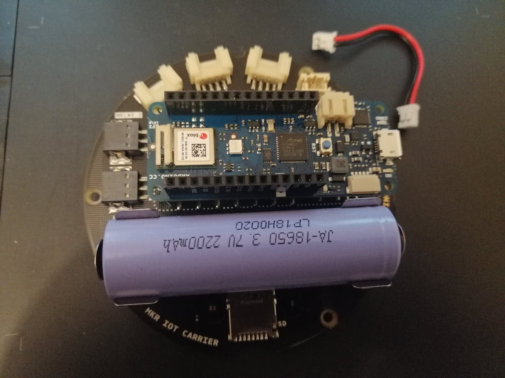

# How to build a temperature and humidity sensor

## Overview

Author: Pauliina Raitaniemi (pr222ja)

Estimated time: 
- 20 min (setup environment)

> Project overview....

### Objective

>Describe why you have chosen to build this specific device. What purpose does it serve? What do you want to do with the data, and what new insights do you think it will give?
>- [ ] Why you chose the project
>- [ ] What purpose does it serve
>- [ ] What insights do you think it will give


### Material
All the material was bought from [https://www.electrokit.com/](https://www.electrokit.com/)

- [Arduino Explore IoT Kit](https://www.electrokit.com/produkt/arduino-explore-iot-kit/) approximate cost: 130 EUR
- [LiPo battery 3.7V 2200mAh](https://www.electrokit.com/produkt/batteri-lipo-18650-cell-3-7v-2200mah/) approximate cost: 5 EUR

**From the Arduino Explore IoT Kit** these parts were used:
- [Arduino MKR WiFi 1010](https://docs.arduino.cc/hardware/mkr-wifi-1010)
- [MKR IoT Carrier](https://docs.arduino.cc/hardware/mkr-iot-carrier)
- Micro USB cable.
- Protective plastic case.
- Cable to connect power to the controller from the board when a battery is used within the carrier.

With the MKR IoT Carrier the built-in HTS221 temperature- and humidity-sensor was utilized, as well as the display and touch buttons for presenting sensor readings directly on the carrier itself.


The Arduino MKR WiFi 1010 micro controller and with the connected micro USB cable.


The MKR IoT Carrier top and bottom without anything connected to it.


The placement of the [HTS221](https://www.st.com/resource/en/datasheet/hts221.pdf) sensor which reads humidity and temperature. The temperature has an accuracy of ± 0.5 °C and works within the ranges of 15 to +40 °C. The humidity has an accuracy of ± 3.5% rH and works withing humid ranges between 20 to +80% rH. The carrier uses the I2C protocol to communicate sensor readings to the controller.


Plastic case for protecting the device. The case is designed so that you can still connect external sensors to the controller and connect with the micro USB cable.


The lithium battery that can be used with the carrier (not included in the Arduino Explore IoT Kit), which enables the device to be run wirelessly. However, the battery will only have enough charge for lasting for about two days or so but it can be re-charged with a micro USB cable to the controller. 


The back- and red-cable to connect the carrier to the mounted controller when using the battery.


### Computer setup
The device was programmed by using a M1 Mac that also runs Rosetta and by using the installed Arduino 2.0 IDE. 

- Using downloaded IDE

The IDE can be dowloaded from [https://www.arduino.cc/en/Guide](https://www.arduino.cc/en/Guide)

To do all necessary steps to get started follow the documentation at [https://docs.arduino.cc/](https://docs.arduino.cc/) and choose the ```MKR WIFI 1010``` board and continue by following ```Quickstart```.

As the quickstart mentions you use the verify-button in the IDE to compile the code in order to make sure that everything runs correctly. Then make sure that the device is connected to the computer with the USB-cable and push the Upload-button to upload the code to the device. 

- To use the web editor together with Arduino IoT Cloud

In order to use the web editor, you need to download a [plugin](https://create.arduino.cc/getting-started/plugin/install) on your computer. [Welcome page to plugin](https://create.arduino.cc/getting-started/plugin/welcome). The preffered browsers to use with it is Chrome or Firefox.

Make sure to register the kit on the Arduino webpage with an Arduino account.

>How is the device programmed? Which IDE are you using? Describe all steps from flashing the firmware to installing plugins in your favorite editor and how flashing is done on MicroPython. The aim is that a beginner should be able to understand.
>- [x] Chosen IDE
>- [x] How the code is uploaded
>- [ ] Steps that you needed to do for your computer. Installation of Node.js, extra drivers, etc.

### Putting everything together

When connecting the controller to the carrier it is important to make sure that the pins match, for example you can see in the image that the GND-pin marked with white coloron bothe the controller and the carrier. It is also important to try keeping the pins as straight as possible.


Use the included black- and red- cable to make a connection between the controller and the carrier. This enables the controller to get energy to the battery that is connected to the carrier and the controller can also charge the battery by connecting the controller with a micro USB cable. When connecting the battery to the carrier, it is important to make sure that the positive and negative side matches. On the battery [the minus side is completely flat](https://www.large.net/news/8ju43mh.html) and should be on the side marked with a minus side as seen in the previous image of the bottom side of the carrier.

The MKR IoT Carrier operates only on 3.3V but is designed to work with a LiPo-battery that has 3.7V. That is good to keep in mind when looking for external sensors to connect with, so you don't accidentally try connecting something that requires for example 5.5V in order to operate. 

However, the carrier does also have two built-in relays with two separate "high power pins" which are capable to handle up to 24V each. An example use of these relays could be to control an external lamp switching it on and off by controlling those higher power pins that connects to an 24V-battery and the lamp. With a maximum capacity to handle 24V, it also means that the carrier should never in any way be connected to a standard power outlet in the wall.

With so many features, form factor and different sensors that the carrier provides it is a very well designed consumer-level product, perfect for the IoT enthusiast. The features used here are just a small part of what is possible to experiment with. 

For more professional setting it becomes much of a question about if the particular use case is broad enough to justify the price, as you can get away with much less if you only are looking for one or two things. On the other hand the form factor could be a benefit if the usage of breadboards is too clumsy.

An important aspect could also be the short battery life as the carrier draws out the battery within a couple of days, depending on the battery. For professional use that may not be enough time for a wireless connection. Then the consideration for where to place it comes into play, since it needs to always be connected to a power source through the micro USB cable. 

### Platform
To start with we will be using the Arduino IoT Cloud platform, using the 1-year tiers that are included with the kit-purchase. 

>Describe your choice of platform. If you have tried different platforms, it can be good to provide a comparison.

>Is your platform based on a local installation or a cloud? Do you plan to use a paid subscription or a free one? Describe the alternatives going forward if you want to scale your idea.

>- [ ] Describe platform in terms of functionality
>- [ ] *Explain and elaborate on what made you choose this platform

### The code
Needed libraries:
- Arduino_MKRIoTCarrier (make sure to install the library together with any needed dependencies)
>Import core functions of your code here, and don't forget to explain what you have done! Do not put too much code here. Focus on the core functionalities. Have you done a specific function that does a calculation, or are you using a clever function for sending data on two networks? Or, are you checking if the value is reasonable, etc.? Explain what you have done, including the setup of the network, wireless, libraries and all that is needed to understand.

```c++=
// import dependencies
#include <Arduino_MKRIoTCarrier.h>

// Instanciate the carrier-object
MKRIoTCarrier carrier;
```
You may need to [calibrate the temperature sensor](https://support.arduino.cc/hc/en-us/articles/4411202645778-How-to-calibrate-the-MKR-IoT-Carrier-s-temperature-sensor). Do do that you adjust the temperature reading value with the difference between the sensors reading and the temperature reading from another temperature reading source.

For example, if the temperature need to be 3 degrees higher, just add ```+3``` to the reading like dipslayed below:
```
float temperature = carrier.Env.readTemperature()+3;
```

```python=
import this as that

def my_cool_function():
    print('not much here')

s.send(package)

# Explain your code!
```


### Data flow / Connectivity
- Vireless protocols used: WiFi
- Transport protocol used: 
- Information models used:

>How is the data transmitted to the internet or local server? Describe the package format. All the different steps that are needed in getting the data to your end-point. Explain both the code and choice of wireless protocols and API information models, if any.
>- [ ] How often is the data sent? 
>- [x] Which wireless protocols did you use (WiFi, LoRa, etc ...)?
>- [ ] Which transport protocols were used (MQTT, webhook, etc ...)
>- [ ] Which information models were used (WoT TD, Fiware, etc...)
>- [ ] *Elaborate on the design choices regarding data transmission and wireless protocols. That is how your choices affect the device range and battery consumption.


### Presenting the data

>Describe the presentation part. How is the dashboard built? How long is the data preserved in the database?
>- [ ] Provide visual examples of how the dashboard looks. Pictures needed.
>- [ ] How often is data saved in the database.
>- [ ] *Explain your choice of database.
>- [ ] *Automation/triggers of the data.


### Finalizing the design


>Show the final results of your project. Give your final thoughts on how you think the project went. What could have been done in another way, or even better? Some pictures are nice!
>- [ ] Show the final results of the project
>- [ ] Pictures
>- [ ] Video presentation of the project

### References
- [Arduino Language Reference](https://www.arduino.cc/reference/en/)
- [All built in Arduino code examples](https://docs.arduino.cc/built-in-examples/)
- [How to use the Arduino_MKRIoTCarrier library](https://www.arduino.cc/reference/en/libraries/arduino_mkriotcarrier/)
- [MKR IoT Carrier Technical Reference/Cheat Sheet](https://docs.arduino.cc/tutorials/mkr-iot-carrier/mkr-iot-carrier-01-technical-reference)
- [Arduino Basics](https://docs.arduino.cc/learn/)
- [Getting started with IoT Cloud - official](https://docs.arduino.cc/cloud/iot-cloud)
- [Getting started with IoT Cloud - in project hub](https://create.arduino.cc/projecthub/133030/iot-cloud-getting-started-c93255)
- [Troubleshooting connection to IoT Cloud](https://support.arduino.cc/hc/en-us/articles/360019355679-If-your-device-can-t-be-added-or-won-t-connect-to-IoT-Cloud)
- [IoT Cloud Technical Reference/Cheat sheet](https://docs.arduino.cc/cloud/iot-cloud/tutorials/technical-reference)
- [Update wifi firmware and upload SSL certs - approximate guide](https://docs.arduino.cc/tutorials/generic/firmware-updater)
- [Another certificate docs, closer to my actual flow](https://support.arduino.cc/hc/en-us/articles/360016119219-How-to-add-certificates-to-Wifi-Nina-Wifi-101-Modules-)
- [Solution for connectivity issues in Arduino IoT Cloud](https://forum.arduino.cc/t/new-topic-error-in-iot-cloud-kit-tutorial/848136/5)
- [Extra - Connect with WifiNINA lib](https://www.arduino.cc/en/Guide/MKRWiFi1010/connecting-to-wifi-network)
- [WifiNINA reference](https://www.arduino.cc/reference/en/libraries/wifinina/)
- [Using Webhooks](https://docs.arduino.cc/cloud/iot-cloud/tutorials/webhooks)
- [Using Node-RED](https://docs.arduino.cc/cloud/iot-cloud/tutorials/nodered)
- [I2C protocol](https://docs.arduino.cc/learn/communication/wire)